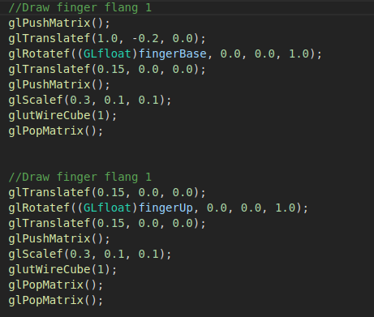

*Name: Amany Bahaa Eldin Mustafa 

*sec.: 1

*B.No. : 18

Robotic Arm

Robotic Arm was the first task which required adding fingers to an existing robotic arm by editing the code and adding them,
I may have some problems with working with some concepts for the first time, so I had difficulties during reading the code,
and dealing with functions, but I think that some practice can handle this problem.
The concept of glPushMatrix and glPopMatrix has solved the requirement for the fingers by making each one independent on others.
as the following code sample illustrates, I have put the code for each finger between glPushMatrix and glPopMatrix and repeated this step for each finger.

but I had a serious problem with the angles of rotation for each object, my code may have wrong angles but I can't imagine well how to make them work properly.

