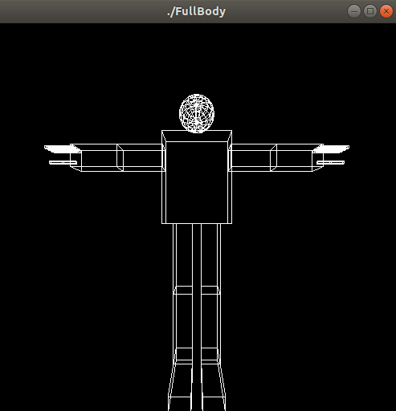

*Name: Amany Bahaa Eldin Mustafa 

*sec.: 1

*B.No. : 18

Full Body

 This is our second Assignment, which required to add other objects to the last Assignment "Robotic Arm" to give the Robot Full Body.
 I have faced problems through the last assignment like dealing with opengl functions, working with transformations properly like getting the best translation and the best angle of rotation, but I can say that I managed to deal with these problems through this assignment more easier than the last one, but I may still have some problems like rotating the same object around two axes for specific movements, So my submission may have some missing parts, I will try to add them and resubmit my assignment one more time.

