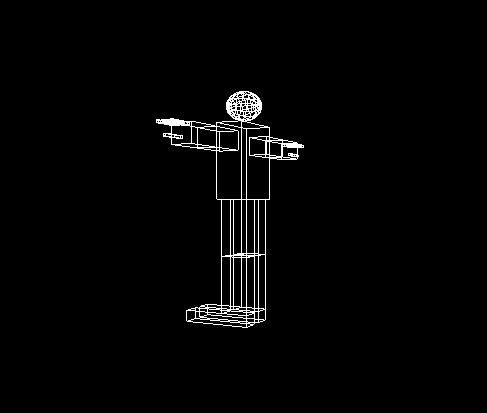
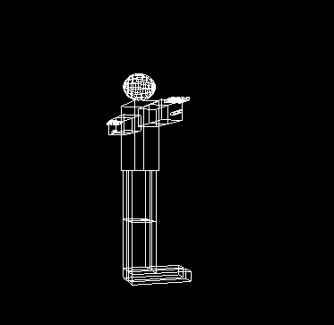
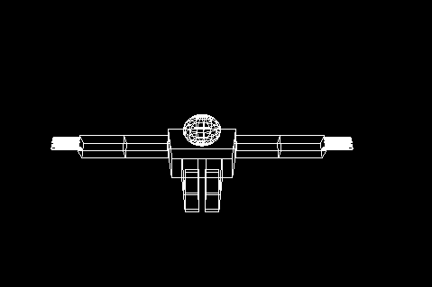
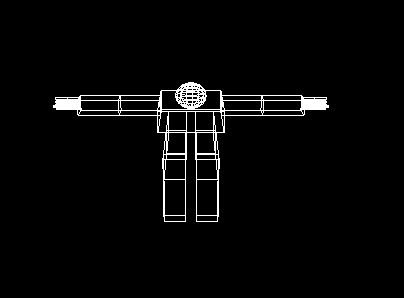
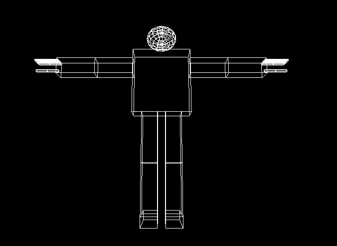
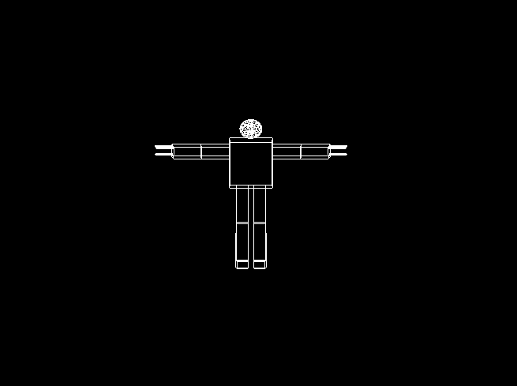

Amany Bahaa El-Din Mustafa

section:1

Bench Number:18

# Assignment 3 report.
# Camera Movement

At this task I've learned how to locate and move Camera around the scene in the world, which is anew experience I've realy enjoyed it.
The camera movement was limited in certain directions, whuch are :

1) Rotation around vertical direction :

1.1. Left Rotation 

1.2. Right Rotation

2) Rotation around horizontal direction:

after applying cross product for look vector and up vector and normalizing the output , we reached the required horizontal axis, and reached:

2.1. Up Rotation

2.2. Down Rotation

3) Moving Forward and Backward:

3.1. Zooming in 

3.2. Zooming out

